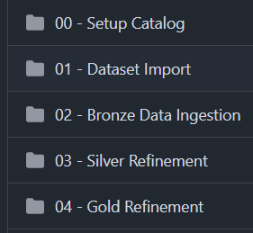
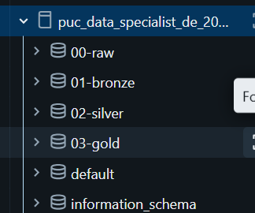
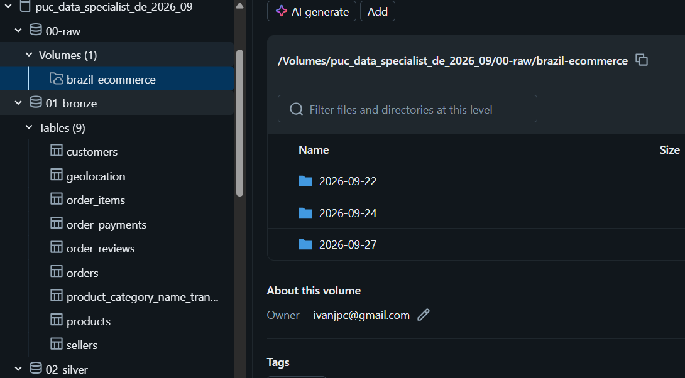
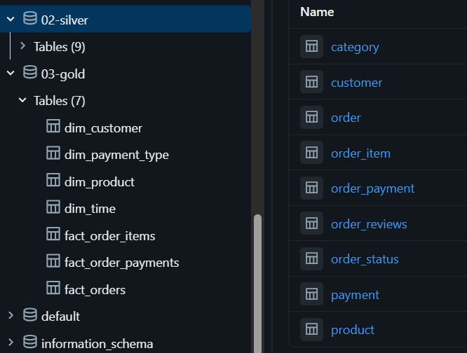
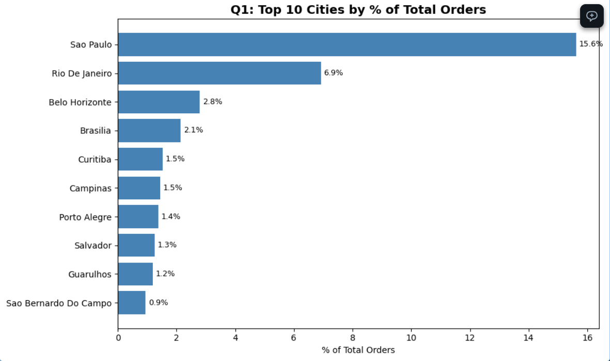
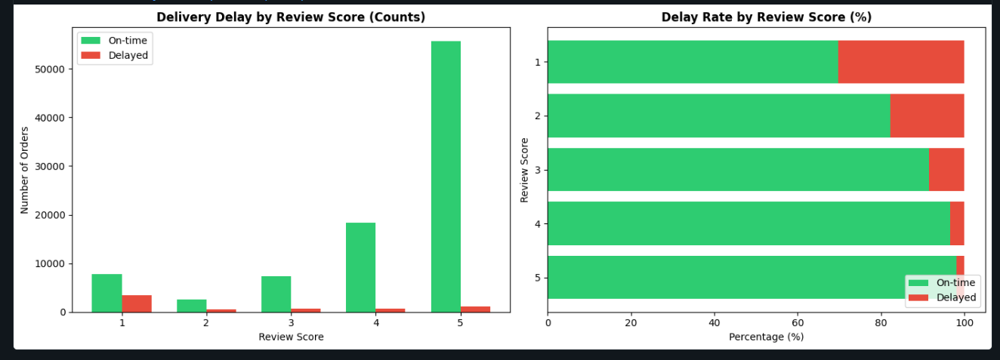
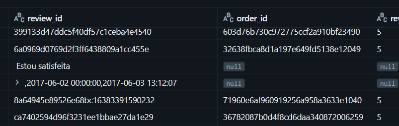

# PUC-RJ - Data Specialist - Data Engineer MVP
- Student: Ivan J P de Carvalho
- Date: Jul-Oct 2026

---

## Dataset
For this MVP, this project will be using the Brazil E-Commerce dataset available on: 
https://www.kaggle.com/datasets/olistbr/brazilian-ecommerce

### Dataset credit

- Owner: http://www.olist.com/


> &#9432; **License:** 
> 
> CC BY-NC-SA 4.0 - https://creativecommons.org/licenses/by-nc-sa/4.0/
>
> The use of this dataset in this project is for Non Commercial use only.


### Why this dataset

The dataset contains **~100K orders** placed between 2016 and 2018 across **4,000+ Brazilian cities**, spanning multiple dimensions: customers, sellers, products, reviews, payments, and logistics. This richness makes it an ideal candidate for a **data warehouse project** that follows the full data engineering lifecycle.

| Criterion | Rationale |
| --- | --- |
| **Realistic complexity** | 9 interconnected CSV files requiring joins, foreign keys, and star-schema modeling — mirrors real-world enterprise data |
| **Rich business dimensions** | Covers geographic, temporal, product, customer, and satisfaction dimensions — enough to build a full DataMart |
| **Well-documented** | Extensive community EDAs on Kaggle allow cross-validation of findings and data quality checks |
| **Brazilian context** | A regional e-commerce market underrepresented in typical data engineering tutorials |
| **Manageable scope** | Small enough to run on serverless compute, yet complex enough to demonstrate medallion architecture best practices |

---

## Data Pipeline (Pipeline de Dados)

### Notebooks
All notebooks are available in layer's subfolder:


**__ATENTION__** : For a first run, all notebooks must be executed in order.

Each Silver and Gold notebooks contain the solution reasoning covering:

- Data Quality Analisys:
    - completeness (Completude)
    - Consistency (Consistência)
    - Uniqueness (Unicidade)
    - Precision (Acurácia)
    - Outliers
- Data Ingestions Scripts
    - It has been decided to use SQL only as much as possible
- Reconciliation SQL's to verify ingestion results


```
Data extract notebook does not contain the information above.
It has been verified, when ingestioning Gold layer, that a data quality verification was needed when ingestioning Bronze layer. 
See session Problems found later in this README.
```

#### Notebooks List: 

*Links to github.
- [00 - Setup Schema and Catalog](https://github.com/IvanJPC/puc-data-specialist-data-engineer-2026/blob/main/00%20-%20Setup%20Catalog/00%20-%20Setup%20Schema%20and%20Catalog.ipynb)
    - **Root catalog**: _puc_data_specialist_de_2026_09_
    - **Goal:** Creates the Databricks catalog and schemas based on medallion architecture for this MVP
    - RAW schema stores the dataset RAW files imported from the dataset cloud (Kaggle)
    - Each Medallion layer is represented by a schema
    

- [01 - Dataset Import](https://github.com/IvanJPC/puc-data-specialist-data-engineer-2026/blob/main/01%20-%20Dataset%20Import/01%20-%20Volume%20Create%20and%20Data%20Import.ipynb)
    - **Goal:** Import the CSV files from Kaggle
    - The CSV files will be stored into a volume in _00-raw_ schema
    - Stores the files into a  folder named with the import date as a metadata of import date
    - Import uses Kaggle API
    - Needs API Token set before run. See notebook pre-requisite session

- [02 - Bronze Ingestion](https://github.com/IvanJPC/puc-data-specialist-data-engineer-2026/blob/main/02%20-%20Bronze%20Data%20Ingestion/02%20-%20Bronze%20Ingestion.ipynb)
    - **Goal:** Data extraction and Bronze layer creation
    - **Schema:** _01-bronze_
    - Creates Bronze tables and injest data from imported files stored in _00-raw_ schema volume
    - Represents dataset imported
    - No business or bigger changes
    - String and Number types only
    - Specific details in the notebook comments
- [03 - Silver - DEA and Transformations](https://github.com/IvanJPC/puc-data-specialist-data-engineer-2026/blob/main/03%20-%20Silver%20Refinement/03%20-%20Silver%20-%20DEA%20and%20Transformations.ipynb)
    - **Goal:** Silver layer creation with data quality check
    - **Schema:** _02-silver_
    - Creates Silver tables and injest data from Bronze layer
    - Execute bronze data checks for data transformation decisions
    - Data refinements
    - Type casts 
    - Value checks 
    - Deduplication and nullable checks
    - Reconciliation checks
    - Specific details in the notebook comments
- [04 - Gold Refinement ](https://github.com/IvanJPC/puc-data-specialist-data-engineer-2026/blob/main/04%20-%20Gold%20Refinement/04%20-%20Gold%20Refinement.ipynb)
    - **Goal:** Business data creation using DW architecture, facts and dims tables 
    - **Schema:** _03-gold_
    - Data Warehouse layer
    - All columns and all tables contains comments to assist on a data catalog creation
    - Schema to be used: Star
    - Specific details in the notebook comments

- [05 - EDA - Business Questions](https://github.com/IvanJPC/puc-data-specialist-data-engineer-2026/blob/main/04%20-%20Gold%20Refinement/05%20-%20EDA%20-%20Business%20Questions.py) 
    - **GOal:** Business Data Analysis
    - **Schema:** _03-gold_


### Proof of resources and table creation after running all ETL notebooks:
#### Raw volumes and Bronze tables


#### Silver and Gold tables




---

## Business Context and questions (Contexto de Negócios e Perguntas)

### The scenario

Olist is a Brazilian marketplace that connects small and medium-sized sellers to customers across the country. When a customer purchases a product on an Olist store, the seller is notified to fulfill that order. Once the customer receives the product — or the estimated delivery date is past due — the customer gets a satisfaction survey by email where they can leave a review score (1–5) and optionally write a comment about their experience.

### Business Questions

**1. Customer & Geographic Intelligence**
- Which cities drive the most order volume and revenue?
- Where should logistics and marketing investment be concentrated?

**2. Logistics & Delivery Performance**
- What percentage of orders are delivered on time vs. delayed?
- How do delivery delays impact customer satisfaction (review scores)?

**3. Product & Category Strategy**
- Which product categories are the top revenue drivers?
- Which categories perform best each month (seasonal trends)?
- What is the full ranking of categories by sales?

**4. Customer Satisfaction Drivers**
- Does freight value influence review scores or order cancellations?
- What patterns exist in customer review comments across score levels?

**5. Operational Data Product**
- A reusable star schema (facts + dimensions) in the Gold layer that can serve dashboards, BI tools, and ad-hoc SQL queries
- Data quality checks (completeness, consistency, uniqueness, accuracy, outliers) applied at every layer
- Reconciliation SQL scripts that validate ingestion integrity across Bronze → Silver → Gold

---
## Data Analisys (Análise de Dados)

The `05 - EDA - Business Questions` notebook answers the business questions defined in this README using the Gold-layer star schema tables with **PySpark DataFrames** and matplotlib visualizations.

### Q1: What are the top 10 cities of customers with most orders?



**Insight:** São Paulo customers accounts for ~16% of all orders — more than double Rio de Janeiro. The top 3 cities contribute over 20% of total order volume. It`s also possible to observe a heavy concentration in major metropolitan areas and capitals.

### Q2: Is there any relation between ratings and delayed delivery?



**Insight:** Delivery delays have a major negative impact on customer satisfaction. While on-time deliveries achieve overwhelmingly positive reviews, delayed deliveries see a dramatic shift toward lower scores.

### Q3: Which categories are top performers each month?

Top 3 categories per month were identified using a window function ranking. The **top 5 overall categories** by total sales are:

1. **Beleza_saude** (Beauty & Health) — most stable performer
2. **Cama_mesa_banho** (Bed, Bath & Table) — strong from mid-2017 onward
3. **Esporte_lazer** (Sports & Leisure) — consistent growth
4. **Informatica_acessorios** (IT Accessories) — peak in Feb 2018
5. **Relogios_presentes** (Watches & Gifts) — strong seasonality, peaks in Q4/Q1

**Insight:** Watches & Gifts shows strong seasonality (holiday/gift-giving periods). Beauty & Health is the most stable performer. Growth accelerates from 2017 to 2018 across all top categories, matching overall business expansion.

### Q4: Does the freight value of a product influence ratings or order cancellations?

| Review Score | Avg Freight (R$) | Item Count |
| --- | --- | --- |
| 1 | 21.22 | 14,009 |
| 2 | 20.98 | 3,811 |
| 3 | 20.29 | 9,323 |
| 4 | 20.06 | 21,118 |
| 5 | 19.58 | 62,939 |

| Order Status | Avg Freight (R$) | Item Count |
| --- | --- | --- |
| DELIVERED | 19.95 | 110,197 |
| CANCELED | 19.65 | 542 |

**Insight:** There is a slight inverse relationship between freight costs and satisfaction. However, the difference is small, suggesting **freight is NOT a primary driver of dissatisfaction**. Canceled vs. delivered orders show almost identical freight costs, confirming freight is not a major cancellation factor.

### Q5: What is the ranking sales per each category?

74 categories total. Top 10 by total sales:

| Rank | Category | Total Sales (R$) | Items | Avg Value (R$) |
| --- | --- | --- | --- | --- |
| 1 | Beleza_saude | 1,441,248 | 9,670 | 149.04 |
| 2 | Relogios_presentes | 1,305,541 | 5,991 | 217.92 |
| 3 | Cama_mesa_banho | 1,241,681 | 11,115 | 111.71 |
| 4 | Esporte_lazer | 1,156,656 | 8,641 | 133.86 |
| 5 | Informatica_acessorios | 1,059,272 | 7,827 | 135.34 |
| 6 | Moveis_decoracao | 902,511 | 8,334 | 108.29 |
| 7 | Utilidades_domesticas | 778,397 | 6,964 | 111.77 |
| 8 | Cool_stuff | 719,329 | 3,796 | 189.50 |
| 9 | Automotivo | 685,384 | 4,235 | 161.84 |
| 10 | Ferramentas_jardim | 584,219 | 4,347 | 134.40 |

**Insight:** The top 5 categories account for R$ 5,8M of total sales. PCs (rank 18) have the highest average order value (R$ 1,146). Beauty & Health leads in both volume AND revenue, making it the flagship category.


---

## Data Load (Carga dos Dados)

This project transforms raw e-commerce transactional data into a **structured analytical data product** (using Medallion architecture and star schema) that enables stakeholders to answer critical business questions.

### Notebooks 
- 04 - Gold Refinement 
    - Creates facts and dims tables - DW layer ingestion
- 05 - EDA - Business Questions 
    - Business Data Analysis

- **Gold layer tables**: 
    - puc_data_specialist_de_2026_09.03-gold.fact_orders
    - dim_time
    - dim_customer

---

## Design and Data Catalog (Modelagem e Catálogo de Dados)


---
## Problems Found Throughout the Project
- Secrets management - I've tryed to use Dababricks secrets but I've just discovered how to store secrets into Dababricks later. See more details in notebook `01 - Volume Create and Data Import`.
- order_reviews extraction - When ingesting the order_reviews into silver layer, it has been discovered, during the Data Analysis from bronze layer, that the data ingestion into bronze layer was not correct for csv olist_order_reviews_dataset.csv. The method used to create the bronze table using read_file function has messed it up the comments when they have commas and bronze layer has received many invalid records and they was not reliable. 
    - See invalid data in order_reviews table below:
    
    - A new solution needs to be found (tech debit)
    - Decision: postpone the import of the order review data into silver layer to a after the tech debit is solved
